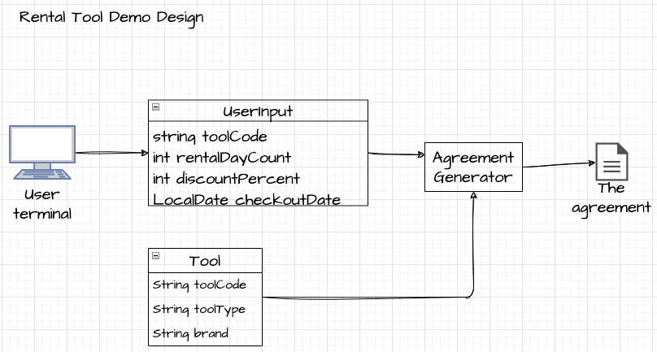

# Programming Demonstration

## Goals
- Create a demo for a point-of-sale application, like Home Depot, that rents big tools
- Customers rent a tool for a specified number of days.
- When a customer checks out a tool, a Rental Agreement is produced.
- The store charges a daily rental fee, whose amount is different for each tool type.
- Some tools are free of charge on weekends or holidays.
- Clerks may give customers a discount that is applied to the total daily charges to reduce the final
charge.

## Requirements
- Java
- Gradle [installation](https://gradle.org/install/)

## Test
```bash
./gradlew test
```
or with --info flag for more detail

```bash
./gradlew test info
```


## Build & Run
Build the application
```bash
./gradlew build
```
Run the app
```bash
./gradlew run --console=plain --quiet
```
We can remove the debug flag for a more clean output
```bash
./gradlew run --args="debug" --console=plain --quiet
```

## Design


The user will have access to the available tool codes, rental prices and their charging policies

### AVAILABLE TOOLS
| Tool Code | Tool Type    | Brand    |
|-----------|--------------|----------|
| CHNS      | Chainsaw    | Stihl    |
| LADW      | Ladder      | Werner   |
| JAKD      | Jackhammer  | DeWalt   |
| JAKR      | Jackhammer  | Ridgid   |


### CHARGING PRICES AND POLICIES
| Name         | Daily Charge | Weekday Charge | Weekend Charge | Holiday Charge |
|--------------|--------------|----------------|----------------|----------------|
| Ladder       | $1.99        | Yes            | Yes            | No             |
| Chainsaw     | $1.49        | Yes            | No             | Yes            |
| Jackhammer   | $2.99        | Yes            | No             | No             |

### Calculating chargeable days
Calculating chargeable days is a complex operation in the AgreementGenerator. We must accurately determine the number of chargeable days for each tool, considering varying weekend and holiday charging policies. This complexity is compounded by the need to calculate fees on observed holidays.

Each option of whether or not we charge for the price on the weekend and holidays have 2 yes, no options. Therefore, we have 4 following cases we must account for:

#### 1. chargeOnWeekend && chargeOnHoliday
In this case the tool charges user on both weekend and holidays. This options assume that we don't want to double charge the user. So if the current day is a holiday and it falls on the weekend, it will only be charged once

#### 2. chargeOnWeekend && not chargeOnHoliday
In this case the tool charges user on the weekend but not on holiday. One crucial call out in this option is that because the observed day of a holiday will default to the nearest weekday, if today (July 4 - Independence day) is on a Sunday, its observed day will be Monday. Have have to be careful so that Monday is not being double-charged.

#### 3. not chargeOnWeekend && chargeOnHoliday
In this case the tool does not charge user on the weekend but charges on holiday (Labor Day or Independence day).

#### 4. not chargeOnWeekend && not chargeOnHoliday
In this case the tool does not charge user on the weekend holiday (Labor Day or Independence day).

In cases 2, 3, 4 when it involves the current day being both a holiday and a weekend we must make sure that the observed day is not double-charged. The code favors the user's experience and loyalty by not charging the user on the holiday weekend if the tool's policies is opposite.

## Test cases

Note: the debug log statements below can be toggled with the --args="debug" flag
```bash
./gradlew run --args="debug" --console=plain --quiet
```

### Test case 2
```txt
Enter tool code: LADW
Enter checkout date (M/d/yy) example 1/1/11: 7/2/20
Enter rental day count: 3
Enter discount percent (0-100): 10

🐛 Checking 2020-07-03
Charge today 2020-07-03 because it's a regular weekday.
Chargeable days 1
🐛 Checking 2020-07-04
This tool charges weekend but not on holidays
No charge on Independence day observed Friday 2020-07-03 because the tool doesn't charge on holiday, independence day on weekend. Chargeable days 0
🐛 Checking 2020-07-05
This tool charges weekend but not on holidays
Charge today 2020-07-06 because the tool charges on weekend. Chargeable days 1
 

 === RENTAL AGREEMENT === 

Tool code: LADW
Tool type: Ladder
Tool brand: Werner
Rental days: 3
Check-out date: 07/02/20
Due date: 07/05/20
Charge days: 1
Pre-discount charge: $1.99
Discount percent: 10%
Discount amount: $0.2
Final charge: $1.79

==========================
```

### Test case 3
```txt
CHECKOUT 

Enter tool code: CHNS
Enter checkout date (M/d/yy) example 1/1/11: 7/2/15
Enter rental day count: 5
Enter discount percent (0-100): 25

🐛 Checking 2015-07-03
Charge today 2015-07-03 because it's a regular weekday.
Chargeable days 1
🐛 Checking 2015-07-04
This tool doesn't charge on weekend but charge on holidays
No charge 2015-07-04 because the tool doesn't charge on weekend. 
 The observed Friday is in the rental range, it was already charged.
Chargeable days: 1
🐛 Checking 2015-07-05
This tool doesn't charge on weekend but charge on holidays
No charge 2015-07-05 because the tool doesn't charge on weekend
Chargeable days: 1
🐛 Checking 2015-07-06
Charge today 2015-07-06 because it's a regular weekday.
Chargeable days 2
🐛 Checking 2015-07-07
Charge today 2015-07-07 because it's a regular weekday.
Chargeable days 3
 

 === RENTAL AGREEMENT === 

Tool code: CHNS
Tool type: Chainsaw
Tool brand: Stihl
Rental days: 5
Check-out date: 07/02/15
Due date: 07/07/15
Charge days: 3
Pre-discount charge: $4.47
Discount percent: 25%
Discount amount: $1.12
Final charge: $3.35

==========================
```

### Test case 4
```txt
Enter tool code: JAKD
Enter checkout date (M/d/yy) example 1/1/11: 9/3/15
Enter rental day count: 6
Enter discount percent (0-100): 0

🐛 Checking 2015-09-04
Charge today 2015-09-04 because it's a regular weekday.
Chargeable days 1
🐛 Checking 2015-09-05
This tool doesn't charge on both weekend and holidays
No charge today 2015-09-05
🐛 Checking 2015-09-06
This tool doesn't charge on both weekend and holidays
No charge today 2015-09-06
🐛 Checking 2015-09-07
This tool doesn't charge on both weekend and holidays
No charge today 2015-09-07 labor day
🐛 Checking 2015-09-08
Charge today 2015-09-08 because it's a regular weekday.
Chargeable days 2
🐛 Checking 2015-09-09
Charge today 2015-09-09 because it's a regular weekday.
Chargeable days 3
 

 === RENTAL AGREEMENT === 

Tool code: JAKD
Tool type: Jackhammer
Tool brand: DeWalt
Rental days: 6
Check-out date: 09/03/15
Due date: 09/09/15
Charge days: 3
Pre-discount charge: $8.98
Discount percent: 0%
Discount amount: $0.0
Final charge: $8.98

==========================
```

### Test case 5
```txt
Enter tool code: JAKR
Enter checkout date (M/d/yy) example 1/1/11: 7/2/15
Enter rental day count: 9
Enter discount percent (0-100): 0

🐛 Checking 2015-07-03
Charge today 2015-07-03 because it's a regular weekday.
Chargeable days 1
🐛 Checking 2015-07-04
This tool doesn't charge on both weekend and holidays
No charge on Independence day observed Friday 2015-07-03 because the tool doesn't charge on holiday, independence day on weekend. Chargeable days: 0
🐛 Checking 2015-07-05
This tool doesn't charge on both weekend and holidays
No charge today 2015-07-05
🐛 Checking 2015-07-06
Charge today 2015-07-06 because it's a regular weekday.
Chargeable days 1
🐛 Checking 2015-07-07
Charge today 2015-07-07 because it's a regular weekday.
Chargeable days 2
🐛 Checking 2015-07-08
Charge today 2015-07-08 because it's a regular weekday.
Chargeable days 3
🐛 Checking 2015-07-09
Charge today 2015-07-09 because it's a regular weekday.
Chargeable days 4
🐛 Checking 2015-07-10
Charge today 2015-07-10 because it's a regular weekday.
Chargeable days 5
🐛 Checking 2015-07-11
This tool doesn't charge on both weekend and holidays
No charge today 2015-07-11
 

 === RENTAL AGREEMENT === 

Tool code: JAKR
Tool type: Jackhammer
Tool brand: Ridgid
Rental days: 9
Check-out date: 07/02/15
Due date: 07/11/15
Charge days: 5
Pre-discount charge: $14.95
Discount percent: 0%
Discount amount: $0.0
Final charge: $14.95

==========================
```

### Test case 6
```txt
Enter tool code: JAKR
Enter checkout date (M/d/yy) example 1/1/11: 7/2/20
Enter rental day count: 4
Enter discount percent (0-100): 50

🐛 Checking 2020-07-03
Charge today 2020-07-03 because it's a regular weekday.
Chargeable days 1
🐛 Checking 2020-07-04
This tool doesn't charge on both weekend and holidays
No charge on Independence day observed Friday 2020-07-03 because the tool doesn't charge on holiday, independence day on weekend. Chargeable days: 0
🐛 Checking 2020-07-05
This tool doesn't charge on both weekend and holidays
No charge today 2020-07-05
🐛 Checking 2020-07-06
Charge today 2020-07-06 because it's a regular weekday.
Chargeable days 1
 

 === RENTAL AGREEMENT === 

Tool code: JAKR
Tool type: Jackhammer
Tool brand: Ridgid
Rental days: 4
Check-out date: 07/02/20
Due date: 07/06/20
Charge days: 1
Pre-discount charge: $2.99
Discount percent: 50%
Discount amount: $1.5
Final charge: $1.5

==========================
```